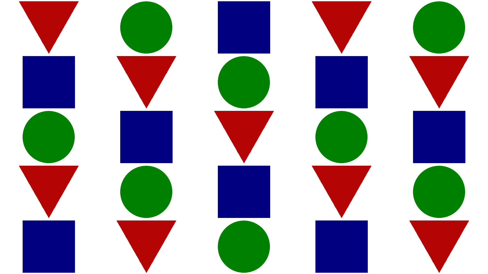
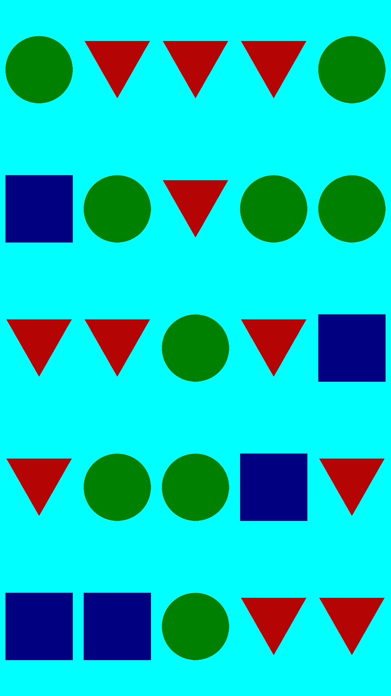

# easy-wallpaper

easy-wallpaper is a simple Python program to create wallpapers based on the generation of image patterns.
It is highly customizable, allowing you to change size, background colors, images to be used in the pattern and their rotation/distribution, use images as backgrounds, and more.

## Installation

Clone this repository in a folder of your choice and navigate to it.

```bash
git clone <url>
cd easy-wallpaper
```

## Usage and examples

This program scans the `images` folder present in the root of this repository for images to generate the patterns. Along with it, there are three basic images and a background you can use to test it. To use your custom images, please place them in the aforementioned folder. Below you can find the list of arguments you can pass to the program (and how to display the list in your terminal), as well as their effects. There are also some examples of wallpapers you could generate with the provided example background and images (which are not very pleasing to look at, since they are mere proof of concepts). Hopefully you can create something prettier than those!

### Check available options
```bash
python gen.py -h
```

```
usage: gen.py [-h] [-b BACKGROUND] [-s SIZE] [-c COLOR] [-rc ROWS_COLS] [-of OFFSET] [-o OUTPUT]
              [-rd] [-rr]

Create a wallpaper based on a generated pattern of images.

options:
  -h, --help            show this help message and exit
  -b BACKGROUND, --background BACKGROUND
                        the background image's file path. If set, overrides size and color parameters.
  -s SIZE, --size SIZE  the background image's size in (width, height) format,
                        defaults to (1920, 1080)
  -c COLOR, --color COLOR
                        the hex code for the color of the wallpaper's background,
                        defaults to white (#ffffff)
  -rc ROWS_COLS, --rows_cols ROWS_COLS
                        the number of image rows and columns added to the wallpaper
                        in (rows, cols) format, defaults to (5, 5)
  -of OFFSET, --offset OFFSET
                        the offset (in pixels) between each image, defaults to 10
  -o OUTPUT, --output OUTPUT
                        the output wallpaper's filename, defaults to 'wallpaper'
  -rd, --rand_dist      randomize the distribution of images (if there is more than
                        one in the folder), defaults to false (places images
                        sequentially in alphabetical order)
  -rr, --rand_rot       randomize the rotation of each image, defaults to false

Note: When choosing the number of columns/rows, try to select divisors of the
width/height respectively, to avoid excessive padding at the edges of the wallpaper.
For the best results, use images with the same or similar inner padding.
```

### Default wallpaper
```
python gen.py -o "examples/example_1"
```


### Light blue wallpaper
```
python gen.py -o "examples/example_2" -c #00ffff -s 1080 1920 -of 30 -rd
```


### Windows XP background wallpaper
```
python gen.py -o "examples/example_3" -b "examples/xp.jpg" -rc 7 5 -rd -rr
```


## Contributing

If you want to improve the code (especially it's speed, since at large row/column values and randomized rotation/distribution it takes a bit of time to complete), open a pull request. If you encounter any bugs while using the program, please let me know by opening an issue. Thank you for your help!

## License

[MIT](https://choosealicense.com/licenses/mit/)